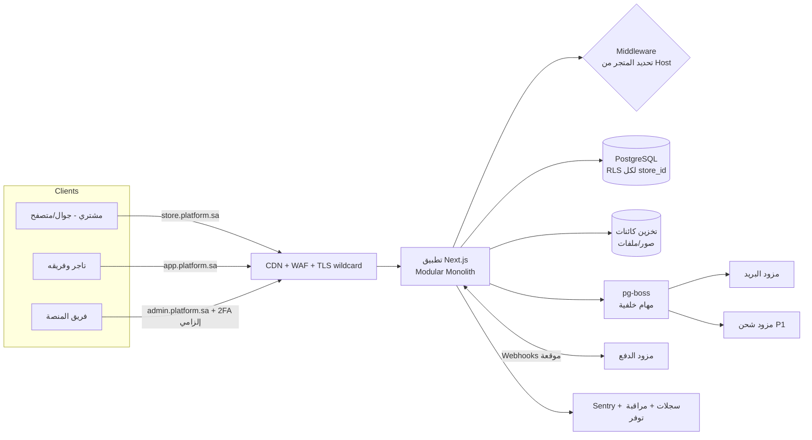

# الوثيقة 01 — الخطة التأسيسية ونطاق الإصدار الأول

| البند | القيمة |
|------|--------|
| الإصدار | 0.1 |
| التاريخ | 2026-09-24 |
| الحالة | مسودة — بانتظار اعتماد المؤسس |
| القرارات التي تحتاج اعتماداً | اسم المنصة، الحزمة التقنية، الاستضافة ومنطقة البيانات، هيكل الباقات، مزود الدفع الأول |

> **تنبيه منهجي:** هذه الوثيقة لا تحتوي على أسعار منافسين أو أرقام سوق أو نصوص قانونية مقتبسة. كل ما يخص السوق والقوانين والمزودين معلَّم بـ **[يحتاج تحقق]** وسيُوثَّق بمصادر رسمية وتاريخ تحقق في وثيقتي دراسة الجدوى وتحليل المنافسين.

---

## 1. الملخص التنفيذي

**ما نبنيه:** منصة SaaS عربية أولاً (RTL) تتيح لأي تاجر في السعودية إنشاء متجر إلكتروني مستقل على رابط فرعي خلال دقائق، وإدارة المنتجات والطلبات والعملاء من لوحة واحدة، دون مطور.

**لماذا قد ننجح رغم وجود سلة وزد وShopify:** لن ننافس في الشهر الأول على عدد الخصائص. الرهان المقترح (فرضية تحتاج اختباراً):

1. **سرعة الوصول إلى أول طلب** للتاجر الصغير الذي يبيع حالياً عبر إنستغرام وواتساب: متجر منشور + أول منتج + رابط قابل للمشاركة في أقل من 15 دقيقة، مع الدفع عند الاستلام والتحويل البنكي من اليوم الأول.
2. **ميزة مرتبطة بخبرة موجودة لديك فعلاً:** صفحة الهبوط الحالية في المستودع تشير إلى أنك تقدم خدمات Google Ads وMerchant Center لتجار على سلة وزد وShopify. هذا يعطينا:
   - قناة استقطاب دافئة (عملاؤك الحاليون ومعارفهم).
   - تمايزاً منطقياً قابلاً للبناء: **متجر جاهز لـ Google Merchant Center من البداية** (بيانات منتجات منظمة، Product Feed، بيانات Schema صحيحة) — P1 بعد الإطلاق مباشرة.
3. **إعداد بمساعدة بشرية** لأول 100 تاجر (Concierge Onboarding) بدلاً من خصائص آلية مكلفة.

**ما سنطلقه خلال 30 يوماً:** إصدار تجاري محدود (Limited Commercial Beta) يغطي الرحلة: تسجيل ← إنشاء متجر ← منتجات ← قالب واحد جيد قابل للتخصيص ← سلة ← إتمام طلب (دفع عند الاستلام / تحويل بنكي) ← إدارة الطلب ← لوحة إدارة أساسية للمنصة. الدفع الإلكتروني بالبطاقات يعمل في **وضع اختبار** إلى أن تكتمل موافقة مزود الدفع.

**هدف 100 تاجر:** نعتبره هدفاً للتسجيل والتفعيل، ونقيس بجانبه مؤشرات أصدق:

| المؤشر | هدف الشهر الأول (فرضية طموحة) |
|--------|-------------------------------|
| تجار مسجلون | 100 |
| متاجر أُنشئت | 70 |
| متاجر أضافت 3 منتجات فأكثر | 40 |
| متاجر منشورة | 30 |
| متاجر استقبلت طلباً حقيقياً (غير تجريبي) | 10 |
| اشتراكات مدفوعة | لا نستهدفها في الشهر الأول (برنامج التجار المؤسسين) |

هذه الأرقام ليست توقعات؛ هي أهداف تشغيلية تُراجع أسبوعياً.

---

## 2. الافتراضات التي نبدأ عليها

كل افتراض له مالك وطريقة تحقق. عند ثبوت خطأ أي افتراض نعدّل الخطة بدلاً من تجاهله.

| # | الافتراض | الأثر إن كان خاطئاً | كيف نتحقق |
|---|----------|---------------------|-----------|
| A1 | تعمل منفرداً (أنت + Claude كمنفذ برمجي) بدوام شبه كامل، مع إمكانية الاستعانة بمصمم مستقل | الجدول الزمني يتضاعف أو يتقلص | سؤالك مباشرة (القسم 9) |
| A2 | السوق الأولي: السعودية، العملة SAR، اللغة العربية أولاً، الإنجليزية P1 | تغيير الضرائب والدفع والشحن | قرار منك |
| A3 | الشريحة الأولى: تجار صغار يبيعون عبر إنستغرام/واتساب/تيك توك + عملاؤك الحاليون في خدمات الإعلانات | عرض القيمة والقالب الأول | 15–20 مقابلة (أيام 1–3) |
| A4 | الدفع عند الاستلام والتحويل البنكي كافيان لأول طلبات فعلية | معدل التحويل منخفض | سؤال التجار في المقابلات عن نسبة COD لديهم |
| A5 | **المنصة لا تستلم أموال مبيعات التجار** في الإصدار الأول؛ كل تاجر يربط حساب مزود الدفع الخاص به | إن أردنا تحصيل الأموال نيابة عن التجار فقد يلزم ترخيص أو ترتيب تنظيمي مع مزود دفع **[يحتاج تحقق: متطلبات البنك المركزي السعودي ونماذج Payment Facilitator لدى المزودين]** | استشارة مزودَي دفع ومستشار قانوني |
| A6 | الشحن في V1 يدوي (التاجر يدخل رقم التتبع)؛ لا تكامل مباشر مع شركات الشحن | تجربة أقل آلية | مقبول للبداية؛ تكامل أول مزود P1 |
| A7 | قاعدة بيانات مشتركة لكل المتاجر مع `store_id` + Row-Level Security | — | اختبارات عزل آلية من اليوم 4 |
| A8 | بيانات العملاء تُستضاف في منطقة سحابية خليجية مناسبة لنظام حماية البيانات الشخصية السعودي | قيود نقل البيانات خارج المملكة **[يحتاج تحقق من اللائحة الحالية لنقل البيانات خارج المملكة ومن محامٍ]** | مراجعة قانونية قبل الإطلاق |
| A9 | الفاتورة الصادرة للمشتري في V1 هي "ملخص طلب" وليست "فاتورة ضريبية" إلى أن نتحقق من متطلبات الفوترة الإلكترونية (فاتورة) لدى هيئة الزكاة والضريبة والجمارك | مخالفة إن سُمّيت فاتورة ضريبية دون امتثال | مستشار محاسبي + بوابة الهيئة **[يحتاج تحقق]** |
| A10 | اشتراك المنصة في الشهر الأول مجاني/مؤسسون؛ الفوترة الآلية للاشتراكات P1 | لا إيراد في الشهر الأول | مقصود: نختبر التفعيل قبل التسعير |
| A11 | الاسم الرمزي "Ayten Commerce" والنطاق الفرعي `*.example-platform.sa` مؤقتان | — | قرار منك |

---

## 3. نطاق الإصدار الأول (30 يوماً)

### 3.1 المبدأ الحاكم

> منتج يستطيع تاجر حقيقي أن يستقبل به طلباً حقيقياً ويكمله — أفضل من 40 خاصية نصف مكتملة.

### 3.2 خصائص P0 (ضرورية للإطلاق)

| المجال | ما يدخل في V1 | ما لا يدخل |
|--------|---------------|------------|
| الحسابات | تسجيل بالبريد وكلمة مرور، تحقق البريد، دخول/خروج، استعادة وتغيير كلمة المرور، جلسات في قاعدة البيانات مع إمكانية إنهاء الجلسات، تحديد محاولات الدخول | 2FA (P1)، الدخول عبر Google/Apple (P1)، OTP بالجوال (P1) |
| المتجر | معالج إعداد (اسم، رابط فرعي، نشاط، شعار، لون، تواصل) مع إمكانية التخطي والعودة؛ منع الأسماء المكررة والمحجوزة؛ نشر/إيقاف المتجر | نطاق خاص (P2)، متاجر متعددة لكل تاجر في الواجهة (البنية تدعمها من الآن، الواجهة P1) |
| الفريق والصلاحيات | المالك + دعوة موظف بدور جاهز (مدير، طلبات، منتجات)؛ فحص صلاحيات على الخادم | أدوار مخصصة (P2) |
| المنتجات | منتج مادي بسيط، منتج بخيارات (حتى 3 خيارات مثل اللون/المقاس)، صور متعددة، سعر/سعر قبل الخصم/تكلفة، SKU، كمية، حالة (مسودة/منشور)، تصنيفات بمستويين، SEO أساسي | منتجات رقمية (P1)، خدمات (P2)، استيراد CSV (P1 — أولوية عالية للمنتقلين)، تصدير CSV (P1) |
| المخزون | كمية لكل متغير، خصم ذري عند الطلب يمنع البيع الزائد، سجل حركات، إرجاع الكمية عند الإلغاء، تنبيه انخفاض | مستودعات متعددة (P3)، جرد (P2) |
| القوالب | **قالب واحد عالي الجودة** مرن (عام/أزياء/عطور) مع أقسام قابلة للترتيب والإخفاء، ألوان، شعار، بانر، روابط تنقل، معاينة ونشر | قوالب إضافية (P1: قالبان)، محرر سحب وإفلات حر (P3) |
| واجهة المتجر | رئيسية، تصنيف، منتج، سلة، إتمام طلب، تأكيد الطلب، تتبع حالة الطلب برقمه + الجوال، صفحات (من نحن، تواصل، سياسات) | حسابات العملاء بكلمة مرور (P1؛ نستخدم الشراء كضيف) |
| السلة والطلب | سلة، إعادة احتساب الأسعار والمخزون على الخادم، ضريبة القيمة المضافة (سعر شامل/غير شامل حسب الإعداد)، إنشاء طلب بلقطة ثابتة للأسعار، رقم طلب تسلسلي لكل متجر، منع الطلب المكرر (Idempotency) | الكوبونات (P1 — أولى أولويات ما بعد الإطلاق)، العروض المركبة (P2)، السلات المتروكة (P1) |
| الدفع | الدفع عند الاستلام، التحويل البنكي اليدوي (التاجر يؤكد الاستلام)، طبقة `PaymentProvider` مجردة + تكامل مزود واحد **في وضع الاختبار** مع Webhook موقّع وIdempotent | تفعيل الدفع الحقيقي بالبطاقات يتم فور موافقة المزود (قد يكون خلال الشهر أو بعده)، الاسترداد الآلي (P1)، الدفع الآجل BNPL (P2) |
| الشحن | شحن ثابت، شحن مجاني فوق مبلغ، سعر حسب المدينة/المنطقة، استلام من المتجر، إدخال شركة الشحن ورقم التتبع يدوياً | تكامل API مع شركة شحن (P1)، الشحن حسب الوزن (P2)، الملصقات (P1 مع التكامل) |
| الطلبات | جدول بحث/تصفية/فرز، ثلاث حالات منفصلة (الدفع، التنفيذ، الشحن)، صفحة تفاصيل، سجل أحداث، ملاحظات داخلية، إلغاء مع سبب وإرجاع المخزون، طباعة ملخص الطلب/إيصال | الاسترجاع الجزئي والكامل عبر المزود (P1)، التعديل على طلب قائم (P2) |
| العملاء | إنشاء تلقائي من الطلبات (بالجوال)، قائمة، ملف عميل بسجل طلباته وإجمالي مشترياته، ملاحظات | التقسيمات (P1)، التصدير (P1) |
| لوحة التاجر | رئيسية بمؤشرات حقيقية (مبيعات، طلبات، جديدة، قيد التنفيذ، متوسط الطلب، منخفض المخزون) مع اختيار الفترة؛ قائمة مهام الإعداد | المقارنة بالفترة السابقة (P1)، الرسوم البيانية المتقدمة (P1) |
| الإشعارات | بريد للتاجر عند طلب جديد، بريد للعميل عند تأكيد الطلب إن أدخل بريده، إشعارات داخل اللوحة | SMS وواتساب (P1 — بعد التحقق من التكاليف وسياسات القوالب) |
| لوحة المنصة | قائمة التجار والمتاجر، بحث، تعطيل/تفعيل متجر بسبب موثق، مؤشرات القمع (تسجيل ← متجر ← منتج ← نشر ← طلب)، سجل تدقيق غير قابل للتعديل من الواجهة | إدارة المحتوى (P1)، إدارة الباقات من الواجهة (P1)، التذاكر (P1) |
| الدعم | زر واتساب/بريد للدعم داخل اللوحة، 10 مقالات مساعدة ثابتة، نموذج ملاحظات | نظام تذاكر (P1) |
| الأمن والتشغيل | TLS، تجزئة كلمات المرور، CSRF، CSP، تحديد المعدل، RLS، سجلات تدقيق، نسخ احتياطي يومي مع **استعادة مجرّبة**، مراقبة أخطاء، مراقبة توفر، Feature Flags لتعطيل الميزات المعطوبة | اختبار اختراق خارجي (قبل التوسع، P1) |
| القانوني | شروط الاستخدام، سياسة الخصوصية، اتفاقية معالجة البيانات مع التاجر، سياسات متجر قابلة للتعديل بنماذج أولية — **تُراجع من محامٍ** | — |

### 3.3 معيار "جاهز للإطلاق" المختصر

- رحلة شراء كاملة (COD) تنجح على جوال فعلي وعلى سطح مكتب.
- اختبار آلي يثبت أن مستخدم متجر (أ) لا يستطيع قراءة أو تعديل أي كيان من متجر (ب) عبر كل مسارات API.
- لا يمكن تغيير سعر أو كمية من المتصفح لتؤثر في إجمالي الطلب.
- تمت استعادة نسخة احتياطية فعلياً إلى بيئة منفصلة.
- تنبيه يصل عند خطأ 5xx متكرر أو توقف الموقع.
- الشروط والسياسات منشورة.

---

## 4. الخصائص المؤجلة

| الأولوية | الخصائص | سبب التأجيل |
|---------|---------|-------------|
| **P1** (الأسابيع 5–8) | الكوبونات؛ استيراد/تصدير CSV للمنتجات؛ تفعيل الدفع الحقيقي بالبطاقات ومدى وApple Pay عبر مزود واحد؛ الاسترداد؛ فوترة اشتراكات المنصة آلياً؛ تكامل شركة شحن واحدة؛ المنتجات الرقمية؛ قالبان إضافيان؛ واجهة إنجليزية؛ 2FA ودخول Google؛ Google Merchant Center Feed وGA4/GTM/Meta Pixel مع إدارة الموافقة؛ نظام تذاكر؛ تقسيمات العملاء؛ السلات المتروكة؛ مساعد AI لوصف المنتجات | مهمة لكنها لا تمنع أول طلب حقيقي، أو تعتمد على موافقات خارجية |
| **P2** (الشهر 3+) | نطاق خاص مع TLS تلقائي؛ الشحن حسب الوزن؛ الخدمات كنوع منتج؛ العروض المركبة والحزم؛ الأدوار المخصصة؛ الجرد؛ مركز مساعدة بفيديوهات؛ مساعد AI لإعداد المتجر؛ تقارير متقدمة؛ SMS/واتساب للعملاء؛ الفاتورة الضريبية المتوافقة (حسب نتيجة التحقق من متطلبات فاتورة) | تحتاج إثبات طلب أو تكلفة تشغيل أعلى |
| **P3** | مستودعات متعددة؛ متجر تطبيقات وAPI عامة للمطورين؛ محرر سحب وإفلات حر؛ نقاط البيع POS؛ تعدد الدول والعملات فعلياً (البنية تدعمه من الآن)؛ مساعد AI تحليلي؛ تطبيق جوال للتاجر | خارج نطاق التحقق من الفكرة |

**ما نبنيه في البنية الآن حتى لا نعيد البناء لاحقاً** (بتكلفة منخفضة): `store_id` في كل جدول، `currency` بجانب كل مبلغ، `country_code` و`locale` على مستوى المتجر، جدول `store_domains` حتى لو استُخدم للنطاق الفرعي فقط، طبقات مجردة للدفع والشحن والبريد، تخزين النصوص القابلة للترجمة بحقول منفصلة `name_ar` / `name_en` أو JSONB (القرار في الوثيقة 02).

---

## 5. البنية التقنية المقترحة

### 5.1 القرار الرئيسي: تطبيق واحد (Modular Monolith) بـ TypeScript

| البند | الخيارات | الاختيار المقترح | السبب |
|------|----------|------------------|------|
| الإطار | Next.js، Remix/React Router، Nuxt، Laravel، Django | **Next.js (App Router) + TypeScript** | لغة واحدة للواجهة والخادم؛ Server Components تقلل JavaScript في واجهات المتاجر (مهم للسرعة على الجوال)؛ أكبر مجتمع وتوفر مطورين؛ يدعم Middleware لتوجيه النطاقات الفرعية. Laravel بديل ممتاز إن كانت خبرتك PHP — **أخبرني** |
| البنية | Monolith، Microservices | **Modular Monolith**: وحدات (auth, stores, catalog, orders, payments, shipping, billing, admin) بحدود واضحة داخل تطبيق واحد | فريق صغير + 30 يوماً؛ Microservices تضاعف التشغيل دون فائدة الآن. الحدود الواضحة تسمح بفصل وحدة لاحقاً |
| قاعدة البيانات | PostgreSQL، MySQL، MongoDB | **PostgreSQL 16+** | معاملات قوية (حاسمة للمخزون والطلبات)، Row-Level Security للعزل، JSONB لإعدادات القوالب، نضج ودعم مُدار في كل السحب |
| ORM | Prisma، Drizzle، Kysely | **Drizzle ORM** + ترحيلات SQL مراجَعة | قريب من SQL، يسهل كتابة التحديث الذري للمخزون وضبط متغيرات جلسة RLS داخل المعاملة، لا يحتاج محرك إضافي. Prisma بديل مقبول وأسهل للمبتدئين لكن العمل مع RLS فيه أكثر تعقيداً |
| التحقق من المدخلات | Zod، Valibot | **Zod** | مخطط واحد يُستخدم في الخادم والنماذج وتوليد OpenAPI |
| المصادقة | Auth.js، Better Auth، Clerk، Supabase Auth، مكتوبة يدوياً | **Better Auth** (مستضاف ذاتياً، جلسات في PostgreSQL) **[يحتاج تحقق من الإصدار الحالي وملاءمة إضافاته عند البدء]** | البيانات تبقى في قاعدتنا (مهم لموقع البيانات)؛ يدعم التحقق بالبريد، الاستعادة، 2FA، OAuth، تحديد المعدل. Clerk أسرع لكنه خدمة خارجية تخزن بيانات المستخدمين خارج سيطرتنا |
| الواجهة | Tailwind + shadcn/ui، MUI، Chakra | **Tailwind CSS (خصائص منطقية لدعم RTL) + shadcn/ui (Radix)** | المكونات تُنسخ في المشروع فنملكها ونعدّلها لـ RTL؛ Radix جيد في إمكانية الوصول |
| الخط | — | خط عربي مفتوح الترخيص (مثل IBM Plex Sans Arabic أو Cairo الموجود في موقعك الحالي) مستضاف ذاتياً | الأداء والخصوصية |
| الطوابير والمهام الخلفية | Redis+BullMQ، pg-boss، خدمة مُدارة | **pg-boss** (طابور داخل PostgreSQL) | لا خدمة إضافية في البداية؛ ننتقل إلى Redis عندما يثبت الحمل الحاجة |
| الكاش | Redis، CDN | **CDN أمام واجهات المتاجر + كاش Next.js**؛ Redis لاحقاً | تقليل التعقيد |
| التخزين | S3، Cloudflare R2، تخزين المزود السحابي | **تخزين متوافق مع S3** في نفس منطقة الاستضافة + CDN للصور؛ تحويل الصور إلى WebP/AVIF بأحجام متعددة | — |
| البريد | Amazon SES، Resend، Postmark | **مزود بريد معاملات واحد** خلف واجهة `EmailProvider` (القرار بعد مقارنة التسليم للعربية والتكلفة) | — |
| المراقبة | Sentry، OpenTelemetry + Grafana، Better Stack | **Sentry للأخطاء (خادم + متصفح) + مراقبة توفر خارجية + سجلات JSON منظمة** | الحد الأدنى الكافي للإطلاق |
| الاختبارات | Vitest، Jest، Playwright | **Vitest** (وحدات وتكامل على PostgreSQL حقيقي في حاوية) + **Playwright** (رحلات E2E على جوال وسطح مكتب، RTL) | — |
| CI/CD | GitHub Actions | **GitHub Actions**: فحص أنواع، lint، اختبارات، ترحيلات، نشر تلقائي لبيئة staging، نشر يدوي للإنتاج | المستودع على GitHub أصلاً |
| إدارة الحزم | npm، pnpm | **pnpm** | — |

### 5.2 الاستضافة وموقع البيانات (قرار يحتاج اعتمادك)

| الخيار | المزايا | العيوب |
|--------|---------|--------|
| **(أ) سحابة كبرى بمنطقة داخل السعودية أو الخليج** (مثل Google Cloud أو Oracle أو مزود محلي بمنطقة داخل المملكة، أو AWS بمنطقة الإمارات/البحرين) — قاعدة بيانات مُدارة + حاويات | أقرب للامتثال لمتطلبات نظام حماية البيانات الشخصية، زمن استجابة منخفض للمشترين | إعداد أولي أطول، تكلفة أعلى قليلاً |
| (ب) Vercel + قاعدة بيانات مُدارة خارج المنطقة | الأسرع للإطلاق | بيانات العملاء خارج المنطقة — قد يتعارض مع قيود النقل **[يحتاج تحقق قانوني]** |

**الاقتراح:** (أ) — حاوية تطبيق + PostgreSQL مُدار بنسخ احتياطي تلقائي واستعادة لنقطة زمنية + تخزين كائنات، **كلها في منطقة واحدة داخل المملكة إن توفرت الخدمات المطلوبة فيها** وإلا في أقرب منطقة خليجية بعد المراجعة القانونية. سأقدم مقارنة تكاليف موثقة بالمصادر قبل الحجز.

### 5.3 مخطط البنية



### 5.4 العزل بين المتاجر (Multi-Tenancy)

| النموذج | العزل | التكلفة التشغيلية عند آلاف المتاجر | القرار |
|---------|------|-------------------------------------|--------|
| قاعدة بيانات لكل متجر | الأقوى | ترحيلات آلاف القواعد، اتصالات كثيرة — غير عملي الآن | ✗ |
| مخطط (Schema) لكل متجر | قوي | ترحيلات آلاف المخططات، تعقيد الاستعلامات عبر المتاجر للإدارة | ✗ |
| **قاعدة مشتركة + `store_id` + RLS** | قوي بطبقات دفاع متعددة | الأبسط والأرخص، والأكثر شيوعاً في منصات SaaS الناشئة | **✓** |

**طبقات الدفاع:**

1. **Middleware**: يحدد المتجر من `Host` (واجهة المتجر) أو من المسار `/stores/:storeId` (لوحة التاجر).
2. **طبقة التفويض**: كل Server Action/Route Handler يمر عبر `requireStoreAccess(storeId, permission)` التي تتحقق من عضوية المستخدم ودوره في `store_members`.
3. **طبقة المستودع (Repository)**: كل دالة وصول للبيانات تستقبل `ctx.storeId` إجبارياً (فحص أنواع يمنع النسيان).
4. **RLS في PostgreSQL**: التطبيق يتصل بدور لا يملك `BYPASSRLS`؛ كل معاملة تبدأ بـ `SET LOCAL app.store_id = '<uuid>'`؛ سياسة كل جدول: `store_id = current_setting('app.store_id')::uuid`. حتى لو نسي مطور شرط `WHERE` لن تعود بيانات متجر آخر.
5. **مفاتيح أجنبية مركبة** `(store_id, id)` بين الجداول التابعة تمنع ربط منتج من متجر بطلب في متجر آخر.
6. **اختبارات عزل آلية** تُشغَّل في CI لكل endpoint.
7. **لوحة المنصة** تستخدم دوراً منفصلاً للقراءة عبر المتاجر، وكل وصول لبيانات متجر يُسجَّل في `audit_logs` مع السبب.

### 5.5 هيكل المستودع المقترح

```
AYTEN/
├── index.html, images/          # موقع الاستشارات الحالي — دون تعديل
├── docs/                        # الوثائق
└── platform/                    # تطبيق المنصة
    ├── src/
    │   ├── app/
    │   │   ├── (marketing)/     # الموقع التعريفي والتسعير
    │   │   ├── (auth)/          # تسجيل، دخول، استعادة
    │   │   ├── dashboard/[storeId]/  # لوحة التاجر
    │   │   ├── admin/           # لوحة المنصة
    │   │   ├── s/[storeSlug]/   # واجهة المتجر (يُعاد التوجيه إليها من الـ Middleware)
    │   │   └── api/             # webhooks وواجهات عامة
    │   ├── modules/             # منطق الأعمال: auth, stores, catalog, inventory, cart, orders, payments, shipping, billing, admin
    │   ├── db/                  # مخطط Drizzle، الترحيلات، سياسات RLS
    │   ├── themes/              # القوالب ومكوناتها وإعداداتها (JSON + Zod)
    │   └── lib/                 # أدوات مشتركة
    ├── tests/ (unit, integration, e2e)
    └── docker-compose.yml       # PostgreSQL + Mailpit + MinIO للتطوير المحلي
```

---

## 6. الهيكل الأولي لقاعدة البيانات

التفاصيل الكاملة (الحقول، الأنواع، الفهارس، القيود، الحذف، الاحتفاظ) في **[الوثيقة 02](./02-database-schema.md)**. القرارات الجوهرية:

- **المعرّفات:** UUID v7 (مرتبة زمنياً، لا تكشف عدد السجلات).
- **المبالغ:** أعداد صحيحة بأصغر وحدة (هللة) `bigint` + `currency char(3)` — لا `float` أبداً.
- **الطلب لقطة ثابتة:** `order_items` تنسخ الاسم وSKU والسعر والضريبة وقت الشراء.
- **ثلاث حالات منفصلة للطلب:** `payment_status`، `fulfillment_status`، `shipment.status`.
- **المخزون:** `inventory_levels` + `inventory_movements` (سجل إلحاقي لا يُعدَّل).
- **الحذف:** حذف منطقي (`archived_at`) للمنتجات والعملاء؛ لا حذف للطلبات والمدفوعات والفواتير؛ حذف/إخفاء هوية بيانات العميل الشخصية عند طلب مشروع مع إبقاء السجل المالي.
- **التدقيق:** `audit_logs` إلحاقي فقط؛ صلاحية `UPDATE/DELETE` مسحوبة من دور التطبيق.

الكيانات الأساسية في V1 (32 جدولاً، منها ما يُنشأ الآن ويُستخدم لاحقاً):

```
المنصة:   users, user_sessions, accounts(OAuth), verification_tokens, platform_admins
المتاجر:  stores, store_domains, store_settings, store_members, roles, role_permissions, invitations
الكتالوج: categories, products, product_options, product_variants, product_images, product_categories
المخزون:  inventory_levels, inventory_movements
البيع:    customers, addresses, carts, cart_items, orders, order_items, order_events, payments, refunds, shipments, shipping_zones, shipping_rates
التسويق:  coupons (الجدول الآن، الواجهة P1)
الفوترة:  plans, subscriptions, invoices
التشغيل:  notifications, support_tickets(P1), audit_logs, webhook_events, integrations, idempotency_keys, order_counters
```

---

## 7. خريطة الشاشات الأساسية

الرمز بجانب كل شاشة = الأولوية.

### 7.1 الموقع التعريفي (`platform.sa`)
- الرئيسية P0 · التسعير / برنامج المؤسسين P0 · التسجيل P0 · الدخول P0 · الشروط والخصوصية P0 · مركز المساعدة (مقالات ثابتة) P0 · المدونة P2

### 7.2 المصادقة والإعداد
- تسجيل ← تحقق البريد ← **معالج الإعداد** (4 خطوات فقط في الواجهة، البقية في قائمة المهام):
  1. اسم المتجر + الرابط المقترح (فحص فوري للتوفر) — P0
  2. مجال النشاط (يحدد الإعدادات الافتراضية للقالب والتصنيفات) — P0
  3. الشعار واللون (قابلة للتخطي) — P0
  4. أول منتج (قابلة للتخطي) — P0
- استعادة كلمة المرور P0 · الجلسات النشطة P0 · 2FA P1

### 7.3 لوحة التاجر (`app.platform.sa/dashboard/[storeId]`)
```
الشريط العلوي: مبدّل المتجر · بحث سريع (P1) · الإشعارات · معاينة المتجر · + منتج · الحساب
الشريط الجانبي:
├── الرئيسية ............ مؤشرات + قائمة مهام الإعداد + آخر الطلبات          P0
├── الطلبات ............. جدول + تصفية ← تفاصيل الطلب (دفع/تنفيذ/شحن/سجل)   P0
├── المنتجات ............ جدول ← نموذج المنتج (خيارات/متغيرات/صور/SEO)       P0
│   ├── التصنيفات ................................................ P0
│   ├── المخزون (عرض الكميات + سجل الحركات) ........................ P0
│   └── الاستيراد/التصدير ........................................ P1
├── العملاء ............. قائمة ← ملف العميل                              P0
├── التسويق ............. الكوبونات P1 · التكاملات (GA4/Pixel/Merchant Center) P1
├── التقارير ............ مبيعات/منتجات أكثر مبيعاً                         P1
├── تصميم المتجر ........ القالب · الأقسام · الألوان · الشعار · القوائم · الصفحات · معاينة/نشر  P0
└── الإعدادات
    ├── معلومات المتجر والتواصل والسجل التجاري/وثيقة العمل الحر [يحتاج تحقق من المتطلب] P0
    ├── الدفع (COD، تحويل بنكي، ربط مزود) ................................ P0
    ├── الشحن (مناطق وأسعار، استلام) ...................................... P0
    ├── الضريبة (تفعيل، رقم ضريبي، شامل/غير شامل) .......................... P0
    ├── السياسات (استرجاع، شحن، خصوصية) .................................. P0
    ├── الفريق والصلاحيات ................................................ P0
    ├── الإشعارات ........................................................ P1
    ├── النطاق ........................................................... P2
    └── الاشتراك والفواتير ................................................ P1
```

### 7.4 واجهة المتجر (`{slug}.platform.sa`)
الرئيسية · التصنيف · المنتج · السلة (درج جانبي + صفحة) · إتمام الطلب (صفحة واحدة، مُحسّنة للجوال) · تأكيد الطلب · تتبع الطلب · من نحن · تواصل · السياسات · 404/المتجر غير متاح — **كلها P0**. حساب العميل P1.

### 7.5 لوحة المنصة (`admin.platform.sa`)
- المؤشرات (قمع التفعيل، متاجر منشورة، طلبات، أخطاء) P0
- التجار والمتاجر (بحث، ملف، تعطيل/تفعيل مع سبب) P0
- سجل التدقيق P0
- الباقات والاشتراكات P1 · التذاكر P1 · المحتوى والإعلانات الداخلية P1 · الأدوار الإدارية المفصلة P1 (في V1: مالك + دعم فقط)

---

## 8. جدول عمل أول 7 أيام

الافتراض: منفِّذ واحد (أنت للقرارات والتواصل مع التجار والمزودين؛ Claude للكود والوثائق). الساعات تقديرية.

| اليوم | المسار التجاري (أنت) | المسار التقني (Claude + مراجعتك) | المخرجات | معيار القبول | الاعتماديات |
|------|----------------------|----------------------------------|----------|--------------|-------------|
| **1** | اعتماد القرارات في القسم 9؛ إرسال طلبات فتح حساب/اختبار لدى 2–3 مزودي دفع (الموافقات تستغرق وقتاً)؛ بدء جدولة المقابلات | إعداد `platform/`: Next.js + TS + Tailwind + shadcn + Drizzle + Vitest + Playwright + ESLint/Prettier؛ `docker-compose` (Postgres، Mailpit، MinIO)؛ GitHub Actions | مشروع يعمل محلياً وCI أخضر | `pnpm dev` يعمل، `pnpm test` ينجح، CI أخضر | قرار الحزمة التقنية |
| **2** | 5 مقابلات تجار (دليل المقابلة يُسلَّم في اليوم 1) | مخطط قاعدة البيانات (الجزء 1: users, sessions, stores, members, roles, settings, domains, audit_logs) + ترحيلات + سياسات RLS + بيانات أولية للأدوار | ترحيلات تعمل | اختبار: استعلام بدون `app.store_id` يعيد صفراً؛ استعلام بمتجر (أ) لا يرى (ب) | اليوم 1 |
| **3** | 5 مقابلات؛ تلخيص أهم 3 مشكلات؛ اعتماد PRD مختصر | المصادقة: تسجيل، تحقق البريد (Mailpit محلياً)، دخول/خروج، استعادة، تحديد محاولات، جلسات قابلة للإنهاء | رحلة المصادقة كاملة | اختبارات تكامل + E2E للتسجيل والاستعادة؛ كلمة المرور مجزأة؛ تحديد المعدل يعمل | اليوم 2 |
| **4** | شراء النطاق وإعداد DNS والبريد؛ اختيار مزود الاستضافة | إنشاء المتجر: معالج الإعداد، فحص الرابط (فريد، محجوز، محارف مسموحة)، `store_members` (مالك)، `requireStoreAccess` | تاجر ينشئ متجراً ويصل للوحته فقط | اختبار عزل: مستخدم (أ) يحصل على 404 عند طلب متجر (ب) | اليوم 3 |
| **5** | 5 مقابلات؛ جمع أمثلة متاجر إنستغرام حقيقية لاختبار القالب | هيكل لوحة التاجر RTL (شريط جانبي، علوي، مبدل متجر، قائمة مهام الإعداد)، إعدادات المتجر الأساسية | لوحة قابلة للتنقل | تعمل على عرض 375px و1440px، بلا تمرير أفقي | اليوم 4 |
| **6** | مراجعة الشاشات وتسجيل ملاحظاتك | الصلاحيات: أدوار جاهزة، دعوة موظف بالبريد، قبول الدعوة، فحص الصلاحيات على كل إجراء؛ سجل تدقيق للإجراءات الحساسة | فريق متعدد المستخدمين | مصفوفة اختبارات: كل دور × كل صلاحية | اليوم 5 |
| **7** | تقرير المقابلات النهائي (15 مقابلة) وتعديل النطاق إن لزم | نشر أول نسخة على staging؛ إعداد Sentry ومراقبة التوفر؛ نسخ احتياطي تلقائي؛ مراجعة أمنية للأسبوع | بيئة staging على رابط حقيقي | رحلة: تسجيل ← متجر ← لوحة ← دعوة موظف تعمل على staging؛ تنبيه خطأ تجريبي يصل | الاستضافة والنطاق |

**نقطة مراجعة نهاية الأسبوع:** هل نتائج المقابلات تؤكد الشريحة الأولى (A3) وأولوية COD (A4)؟ إن لا، نعيد ترتيب الأسبوعين 2–3 قبل بناء المنتجات والسلة.

---

## 9. المعلومات التي أحتاجها منك قبل بدء التطوير

**قرارات تمنع البدء (أحتاجها الآن):**

1. **الاسم:** هل تستخدم علامة "Ayten" الحالية للمنصة، أم اسماً جديداً؟ (استخدامها يستفيد من سمعتك مع التجار، لكنه قد يخلط بين خدمة الاستشارات والمنصة.) وهل لديك نطاق؟
2. **الحزمة التقنية:** هل توافق على Next.js + TypeScript + PostgreSQL + Drizzle؟ أم لديك خبرة في لغة أخرى (PHP/Laravel مثلاً) تفضّل أن تستطيع صيانتها بنفسك؟
3. **فريق العمل والوقت:** كم ساعة يومياً تستطيع تخصيصها؟ هل لديك مطور أو مصمم أو ميزانية لمستقل؟
4. **مكان الكود:** هل أبني المنصة داخل هذا المستودع في مجلد `platform/` (مقترح) أم في مستودع جديد؟ وهل لديك الكود المصدري لموقع `index.html` الحالي (الموجود ناتج بناء فقط)؟

**قرارات مهمة خلال الأسبوع الأول:**

5. **الكيان القانوني:** هل لديك سجل تجاري في السعودية (أو في دولة أخرى)؟ هذا يحدد مزودي الدفع الممكن التعاقد معهم وأسلوب إصدار فواتير الاشتراك والتسجيل الضريبي.
6. **الميزانية الشهرية المبدئية** للاستضافة والأدوات والتسويق (نطاق تقريبي يكفي).
7. **الاستضافة وموقع البيانات:** هل توافق على الاستضافة في منطقة داخل المملكة/الخليج (مقترح) حتى لو كانت أعلى تكلفة قليلاً؟
8. **مزود الدفع:** هل لديك حسابات لدى أي مزود دفع حالياً؟ (أستطيع إعداد مقارنة موثقة بالمصادر لمزودين محليين.)
9. **الشريحة الأولى:** هل عملاؤك الحاليون في خدمات الإعلانات تجار يمكن التواصل معهم للمقابلات والتجربة؟ وكم عددهم تقريباً؟
10. **الباقات:** هل توافق على مبدأ "مجاني/مؤسسون في الشهر الأول، ثم تسعير يُحدد بعد تحليل المنافسين والمقابلات"؟

---

## 10. أول مجموعة مهام تنفيذية (قابلة للبدء فوراً)

| # | المهمة | المنفذ | المدة | ناتج قابل للتحقق |
|---|--------|--------|------|------------------|
| T1 | الرد على أسئلة القسم 9 (البنود 1–4 على الأقل) | أنت | 30 دقيقة | قرارات مكتوبة |
| T2 | إعداد دليل مقابلات التجار (15–20 مقابلة) + نموذج تسجيل النتائج وتصنيف المشكلات بالتكرار والأثر | Claude | اليوم 1 | ملف `docs/03-interview-guide.md` + جدول |
| T3 | إرسال طلبات حسابات تجريبية لمزودي دفع + سؤالهم عن نموذج "منصة متعددة التجار" | أنت (بمسودة رسالة من Claude) | يوم | ردود المزودين |
| T4 | بحث موثق عن المنافسين (أسعار وخصائص وقيود الباقات) مع روابط وتاريخ التحقق | Claude (بحث ويب) | يوم | `docs/04-competitors.md` |
| T5 | بحث موثق للمتطلبات التنظيمية السعودية (نظام التجارة الإلكترونية، نظام حماية البيانات الشخصية ولائحة نقل البيانات، الفوترة الإلكترونية، ضريبة القيمة المضافة، متطلبات عرض السجل التجاري/وثيقة العمل الحر) مع تحديد ما يحتاج محامياً/محاسباً | Claude + مراجعة مختص | يوم | `docs/05-compliance-checklist.md` |
| T6 | تهيئة مشروع `platform/` وCI وبيئة التطوير المحلية | Claude | يوم (بعد T1) | CI أخضر، تعليمات تشغيل في README |
| T7 | ترحيلات قاعدة البيانات الأولى + RLS + اختبارات العزل | Claude | يوم | اختبارات عزل تنجح في CI |
| T8 | نظام المصادقة الكامل | Claude | يوم | اختبارات تكامل + E2E |
| T9 | قائمة قصيرة (20–30 تاجراً) من عملائك ومعارفك للتواصل الأول | أنت | يومان | قائمة في جدول |
| T10 | شراء النطاق وتجهيز بريد المنصة | أنت | ساعة | نطاق فعال |

**عند قولك «ابدأ التنفيذ»** سأبدأ بـ T6 ثم T7 ثم T8 مع تسليم كل مرحلة وفق القالب المتفق عليه (ما بُني، الملفات، التشغيل، الاختبار، النتائج الفعلية، المشكلات، المخاطر، الخطوة التالية). وبالتوازي أستطيع إنجاز T2 وT4 وT5 فوراً دون انتظار قرارات التقنية.

---

## الأسئلة المفتوحة والمخاطر الرئيسية

| # | المخاطرة | الاحتمال | الأثر | التخفيف |
|---|---------|---------|------|---------|
| R1 | تأخر موافقة مزود الدفع | مرتفع | متوسط | COD وتحويل بنكي من اليوم الأول؛ الطلبات تُقدَّم مبكراً (T3) |
| R2 | التسجيلات لا تتحول إلى متاجر منشورة | مرتفع | مرتفع | إعداد بمساعدة بشرية، قائمة مهام، متابعة يومية للقمع |
| R3 | 30 يوماً غير كافية لمنفذ واحد | متوسط | مرتفع | نطاق P0 صارم؛ أي تأخر يؤجل خصائص لا الجودة والأمن |
| R4 | متطلبات تنظيمية غير محسوبة (بيانات، فوترة) | متوسط | مرتفع | T5 + مراجعة مختص قبل الإطلاق العام |
| R5 | تسرب بيانات بين المتاجر | منخفض (مع RLS) | حرج | 7 طبقات دفاع + اختبارات آلية |
| R6 | منافسة مباشرة مع منصات راسخة | مؤكد | مرتفع | تمايز محدد (السرعة للتاجر الصغير + جاهزية Google) وليس عدد الخصائص؛ يُختبر في المقابلات |
