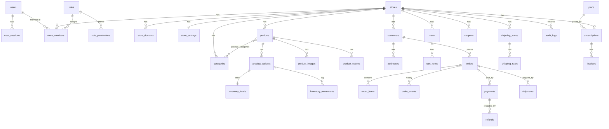

# الوثيقة 02 — الهيكل الأولي لقاعدة البيانات

| البند | القيمة |
|------|--------|
| الإصدار | 0.1 |
| التاريخ | 2026-09-24 |
| الحالة | مسودة — تُحوَّل إلى ترحيلات Drizzle بعد اعتماد الحزمة التقنية |
| قاعدة البيانات | PostgreSQL 16+ |

## 1. اصطلاحات عامة

| الاصطلاح | القاعدة |
|----------|---------|
| المفتاح الأساسي | `id uuid` (UUID v7 يُولَّد في التطبيق) |
| العزل | كل جدول تابع لمتجر يحتوي `store_id uuid not null` + سياسة RLS + فهرس يبدأ بـ `store_id` |
| المفاتيح الأجنبية داخل المتجر | مركبة `(store_id, x_id) → x(store_id, id)` لمنع الربط عبر المتاجر |
| المبالغ | `bigint` بأصغر وحدة (هللة) + `currency char(3)`؛ التحقق `>= 0` حيث يلزم |
| الوقت | `timestamptz`؛ كل جدول فيه `created_at`، والقابل للتعديل فيه `updated_at` |
| الحالات | `text` + `CHECK` (أسهل في الترحيل من `enum`) |
| النصوص المترجمة | الحقول الظاهرة للمشتري: `name text` بلغة المتجر الافتراضية + `translations jsonb` (P1 للإنجليزية) |
| الحذف | منطقي بـ `archived_at` للكيانات التجارية؛ لا حذف للسجلات المالية |
| البريد | `citext` للمقارنة غير الحساسة لحالة الأحرف |
| الجوال | `text` بصيغة E.164 بعد التطبيع |

## 2. مخطط العلاقات (ERD) — الكيانات الجوهرية



## 3. الجداول

### 3.1 الهوية والجلسات (على مستوى المنصة، بدون `store_id`)

**users**
| الحقل | النوع | القيود |
|------|------|--------|
| id | uuid | PK |
| email | citext | unique, not null |
| email_verified_at | timestamptz | null |
| password_hash | text | null (null لمستخدمي OAuth فقط) — Argon2id أو scrypt حسب مكتبة المصادقة |
| name | text | not null |
| phone | text | null |
| locale | text | default `'ar'` |
| two_factor_enabled | boolean | default false |
| status | text | CHECK in (`active`,`suspended`,`deleted`) |
| last_login_at, created_at, updated_at | timestamptz | |

الحذف: عند طلب حذف الحساب تُزال البيانات الشخصية (`email` → قيمة مجهولة فريدة، `name`، `phone`) ويبقى السجل للربط بسجلات التدقيق.

**user_sessions** — `id`, `user_id → users ON DELETE CASCADE`, `token_hash text unique` (لا نخزن الرمز نفسه), `ip inet`, `user_agent text`, `expires_at`, `revoked_at`, `created_at`. فهرس `(user_id, expires_at)`. الاحتفاظ: حذف الجلسات المنتهية بعد 30 يوماً.

**accounts** (مزودو OAuth، P1) · **verification_tokens** (`identifier`, `token_hash`, `purpose` in (`email_verify`,`password_reset`,`invite`), `expires_at`, `used_at`) · **platform_admins** (`user_id PK → users`, `role` in (`owner`,`admin`,`support`,`finance`,`content`,`reviewer`), `mfa_required boolean default true`).

### 3.2 المتاجر والصلاحيات

**stores**
| الحقل | النوع | القيود |
|------|------|--------|
| id | uuid | PK |
| owner_user_id | uuid | FK users, not null, ON DELETE RESTRICT |
| name | text | not null, طول 2–60 |
| slug | citext | unique, CHECK `^[a-z0-9](?:[a-z0-9-]{1,38}[a-z0-9])$`، ليس في `reserved_slugs` |
| business_type | text | (`fashion`,`beauty`,`electronics`,`digital`,`general`,…) |
| country_code | char(2) | default `'SA'` |
| currency | char(3) | default `'SAR'` |
| default_locale | text | default `'ar'` |
| timezone | text | default `'Asia/Riyadh'` |
| status | text | CHECK in (`draft`,`published`,`paused`,`suspended`) |
| suspended_reason | text | null |
| published_at, created_at, updated_at | timestamptz | |

**reserved_slugs** — `slug citext PK`, `reason text` (www, app, admin, api, mail, help, blog, أسماء علامات تجارية معروفة…).

**store_domains** — `id`, `store_id`, `hostname citext unique`, `type` in (`subdomain`,`custom`), `is_primary`, `verification_token`, `verified_at`, `tls_status`. فهرس فريد جزئي: نطاق أساسي واحد لكل متجر.

**store_settings** (1:1) — `store_id PK/FK`, `contact_email`, `contact_phone`, `whatsapp`, `logo_url`, `theme_key text`, `theme_config jsonb` (يُتحقق منه بـ Zod لكل قالب), `tax_enabled bool`, `tax_rate_bps int` (15% = 1500)، `prices_include_tax bool default true`, `vat_number text`, `commercial_registration text`, `policies jsonb`, `checkout_config jsonb`, `onboarding jsonb` (حالة قائمة المهام), `updated_at`.

**roles** — `id`, `store_id null` (null = دور نظامي جاهز), `key` (`owner`,`manager`,`orders`,`products`,`marketing`,`support`,`viewer`), `name`. unique `(store_id, key)`.

**role_permissions** — `(role_id, permission)` PK. الصلاحيات نصوص ثابتة في الكود:
`products.read`, `products.write`, `orders.read`, `orders.write`, `customers.read`, `customers.export`, `inventory.write`, `reports.read`, `team.manage`, `settings.write`, `billing.read`, `billing.manage`, `design.write`.

**store_members** — `id`, `store_id`, `user_id`, `role_id`, `status` in (`active`,`invited`,`removed`), `invited_by`, `created_at`. unique `(store_id, user_id)`. مالك واحد بالضبط لكل متجر (فهرس فريد جزئي على `role_key='owner'`).

**invitations** — `id`, `store_id`, `email`, `role_id`, `token_hash`, `expires_at`, `accepted_at`, `invited_by`.

### 3.3 الكتالوج

**categories** — `id`, `store_id`, `parent_id` (FK مركب إلى نفس الجدول، ON DELETE SET NULL؛ حد عمق 2 في V1 يُفرض بالتطبيق), `name`, `slug`, `image_url`, `position int`, `seo jsonb`, `archived_at`. unique `(store_id, slug)`.

**products**
| الحقل | النوع | القيود |
|------|------|--------|
| id | uuid | PK |
| store_id | uuid | not null |
| type | text | CHECK in (`physical`,`digital`,`service`) — V1 يفعّل `physical` فقط |
| name | text | not null |
| slug | text | unique `(store_id, slug)` |
| description_html | text | يُنقّى على الخادم (allowlist) قبل الحفظ |
| short_description | text | |
| status | text | (`draft`,`active`,`archived`) |
| tax_class | text | (`standard`,`exempt`) |
| requires_shipping | bool | |
| seo | jsonb | title, description |
| translations | jsonb | P1 |
| created_at, updated_at, archived_at | timestamptz | |

فهارس: `(store_id, status, created_at desc)`، GIN على `to_tsvector('simple', name)` للبحث (البحث العربي المتقدم P2).

**product_options** — `id`, `store_id`, `product_id`, `name` (اللون), `position`, `values text[]`. حد 3 خيارات لكل منتج في V1.

**product_variants** — كل منتج له متغير واحد على الأقل (المنتج البسيط = متغير افتراضي). `id`, `store_id`, `product_id` (ON DELETE CASCADE), `sku text` (unique جزئي `(store_id, sku) where sku is not null`), `barcode`, `option_values jsonb` (`{"اللون":"أسود","المقاس":"M"}`), `price bigint not null check >= 0`, `compare_at_price bigint` (check > price), `cost bigint`, `weight_grams int`, `dimensions jsonb`, `image_id`, `position`, `archived_at`.

**product_images** — `id`, `store_id`, `product_id`, `storage_key`, `alt`, `width`, `height`, `position`. الحذف: عند حذف الصورة يُجدول حذف الملف من التخزين عبر مهمة خلفية.

**product_categories** — `(store_id, product_id, category_id)` PK.

### 3.4 المخزون

**inventory_levels** — `(store_id, variant_id)` PK، `track_inventory bool`، `on_hand int not null check >= 0`، `reserved int not null default 0 check >= 0 and reserved <= on_hand`، `low_stock_threshold int`، `updated_at`.
المتاح = `on_hand - reserved`.

**inventory_movements** (إلحاقي فقط) — `id`, `store_id`, `variant_id`, `delta int` (موجب/سالب), `reason` in (`initial`,`manual_adjust`,`order_reserved`,`order_committed`,`order_released`,`return_restock`,`import`), `order_id null`, `actor_user_id null`, `note`, `created_at`. فهرس `(store_id, variant_id, created_at desc)`.

**منع البيع الزائد:** داخل معاملة إنشاء الطلب، لكل بند:
```sql
UPDATE inventory_levels
   SET reserved = reserved + $qty, updated_at = now()
 WHERE store_id = $store AND variant_id = $variant
   AND (NOT track_inventory OR on_hand - reserved >= $qty)
RETURNING variant_id;
```
إن لم يُرجِع صفاً ← نفشل المعاملة كلها برسالة "الكمية غير متوفرة". التحديث الشرطي ذري في PostgreSQL فلا يُباع آخر قطعة مرتين. عند التسليم/الشحن: `on_hand -= qty, reserved -= qty`. عند الإلغاء أو انتهاء مهلة دفع إلكتروني غير مكتمل: `reserved -= qty`. كل ذلك مع حركة في `inventory_movements`.

### 3.5 العملاء والسلات

**customers** — `id`, `store_id`, `phone` (unique `(store_id, phone)`), `email citext`, `first_name`, `last_name`, `accepts_marketing bool default false`, `marketing_consent_at`, `note`, `orders_count int`, `total_spent bigint`, `last_order_at`, `anonymized_at`, `created_at`, `updated_at`.
الخصوصية: عند طلب حذف مشروع ← إخفاء الهوية (`anonymized_at`) مع إبقاء الطلبات لأغراض محاسبية لمدة الاحتفاظ النظامية **[يحتاج تحقق من المدة]**.

**addresses** — `id`, `store_id`, `customer_id`, `country_code`, `region`, `city`, `district`, `street`, `building_no`, `postal_code`, `short_address` (العنوان الوطني المختصر، اختياري), `details`, `lat`, `lng`, `is_default`.

**carts** — `id`, `store_id`, `token_hash` (كوكي HttpOnly للمشتري), `customer_id null`, `currency`, `coupon_code`, `expires_at`, `created_at`, `updated_at`. الاحتفاظ: حذف السلات المهجورة بعد 30 يوماً (أو الاحتفاظ لاستعادة السلات P1 بموافقة).

**cart_items** — `id`, `store_id`, `cart_id` (CASCADE), `variant_id`, `quantity int check 1..999`. unique `(cart_id, variant_id)`. **لا سعر هنا** — السعر يُحسب دائماً على الخادم.

### 3.6 الطلبات

**order_counters** — `store_id PK`, `last_number bigint`. يُحدَّث بـ `UPDATE … SET last_number = last_number + 1 RETURNING` داخل معاملة الطلب ← أرقام تسلسلية بلا تكرار لكل متجر.

**orders**
| الحقل | النوع | ملاحظات |
|------|------|--------|
| id | uuid | PK |
| store_id | uuid | |
| number | bigint | unique `(store_id, number)` — يظهر للعميل |
| customer_id | uuid | FK مركب، ON DELETE RESTRICT |
| source | text | (`storefront`,`manual`,`import`) |
| currency | char(3) | |
| subtotal, discount_total, shipping_total, tax_total, grand_total | bigint | CHECK `grand_total = subtotal - discount_total + shipping_total + tax_total` (عند الأسعار غير الشاملة؛ يُضبط الشرط حسب `prices_include_tax`) |
| prices_include_tax | bool | لقطة من إعداد المتجر |
| payment_method | text | (`cod`,`bank_transfer`,`card`,…) |
| payment_status | text | `pending`,`authorized`,`paid`,`partially_refunded`,`refunded`,`voided`,`failed` |
| fulfillment_status | text | `unfulfilled`,`processing`,`ready`,`fulfilled`,`cancelled` |
| status | text | ملخص للواجهة: `open`,`completed`,`cancelled` |
| customer_snapshot | jsonb | الاسم والجوال والبريد وقت الطلب |
| shipping_address | jsonb | لقطة |
| shipping_method | jsonb | لقطة (الاسم والسعر) |
| coupon_code | text | |
| notes_customer | text | |
| cancelled_at, cancel_reason | | |
| idempotency_key | text | unique `(store_id, idempotency_key)` لمنع الطلب المكرر |
| created_at, updated_at | | |

فهارس: `(store_id, created_at desc)`، `(store_id, payment_status)`، `(store_id, fulfillment_status)`، `(store_id, customer_id)`.

**order_items** — `id`, `store_id`, `order_id`, `variant_id null` (ON DELETE SET NULL — الطلب يبقى صالحاً إن حُذف المنتج), `product_name`, `variant_title`, `sku`, `image_url`, `unit_price`, `quantity`, `discount_amount`, `tax_rate_bps`, `tax_amount`, `line_total`, `requires_shipping`. **لقطة ثابتة لا تتأثر بتعديل المنتج.**

**order_events** (إلحاقي) — `id`, `store_id`, `order_id`, `type` (`created`,`payment_status_changed`,`fulfillment_status_changed`,`shipment_created`,`note_added`,`cancelled`,`customer_notified`…), `from`, `to`, `actor_type` (`system`,`user`,`customer`,`provider`), `actor_id`, `data jsonb`, `created_at`.

**order_notes** (داخلية) — `id`, `store_id`, `order_id`, `author_user_id`, `body`, `created_at`.

### 3.7 الدفع والاسترداد

**payments** — `id`, `store_id`, `order_id`, `provider` (`manual_cod`,`manual_bank`,`<provider_key>`), `provider_payment_id` (unique `(provider, provider_payment_id)`), `amount`, `currency`, `status` (`initiated`,`pending`,`authorized`,`captured`,`failed`,`cancelled`), `failure_code`, `raw_status text`, `created_at`, `updated_at`.
**لا نخزن أي بيانات بطاقة** (رقم، CVV، تاريخ) — الإدخال يتم في صفحة/مكوّن المزود المستضاف.

**refunds** — `id`, `store_id`, `payment_id`, `order_id`, `amount check > 0`, `reason`, `status`, `provider_refund_id`, `restock bool`, `created_by`, `created_at`. قيد تطبيقي: مجموع المسترد ≤ المبلغ المحصّل (يُفحص داخل معاملة مع قفل صف الدفع).

**webhook_events** — `id`, `provider`, `event_id` (unique `(provider, event_id)` ← يمنع المعالجة المزدوجة), `store_id null`, `type`, `payload jsonb` (بعد حذف الحقول الحساسة), `signature_valid bool`, `received_at`, `processed_at`, `attempts`, `last_error`. الاحتفاظ: 90 يوماً للحمولة، ثم يبقى السجل بلا حمولة.

**idempotency_keys** — `(scope, key)` PK، `request_hash`, `response jsonb`, `created_at`؛ حذف بعد 24 ساعة.

### 3.8 الشحن

**shipping_zones** — `id`, `store_id`, `name`, `country_code`, `regions text[]`, `cities text[]`.
**shipping_rates** — `id`, `store_id`, `zone_id`, `type` (`flat`,`free_over`,`pickup`,`weight` P2), `name`, `price`, `min_subtotal`, `estimated_days text`, `active`.
**shipments** — `id`, `store_id`, `order_id`, `carrier` (نص حر في V1), `tracking_number`, `tracking_url`, `status` (`pending`,`ready`,`shipped`,`in_transit`,`delivered`,`returned`,`cancelled`), `shipped_at`, `delivered_at`, `provider_shipment_id`, `label_url`, `created_at`.

### 3.9 التسويق

**coupons** — `id`, `store_id`, `code citext` (unique `(store_id, code)`), `type` (`percent`,`fixed`,`free_shipping`), `value`, `starts_at`, `ends_at`, `min_subtotal`, `usage_limit`, `usage_limit_per_customer`, `used_count`, `applies_to jsonb` (منتجات/تصنيفات/استثناءات), `active`. (الجدول يُنشأ الآن، الواجهة P1.)
**discounts** (عروض آلية، P2) — تُصمم لاحقاً.

### 3.10 فوترة المنصة (منفصلة تماماً عن مدفوعات المتاجر)

**plans** — `id`, `key`, `name`, `price_monthly`, `price_yearly`, `currency`, `limits jsonb` (`products`, `staff`, `orders_per_month`…), `features jsonb`, `is_public`, `archived_at`. الأسعار لا تُعدّل على خطة لها مشتركون؛ تُنشأ نسخة جديدة.
**subscriptions** — `id`, `store_id unique` (اشتراك فعال واحد), `plan_id`, `status` (`trialing`,`active`,`past_due`,`grace`,`expired`,`cancelled`), `trial_ends_at`, `current_period_start`, `current_period_end`, `cancel_at_period_end`, `provider_subscription_id`.
**invoices** — `id`, `store_id`, `subscription_id`, `number` (تسلسلي على مستوى المنصة), `subtotal`, `tax`, `total`, `currency`, `status` (`draft`,`issued`,`paid`,`void`), `issued_at`, `paid_at`, `pdf_key`. **لا تُعدّل بعد الإصدار**؛ التصحيح بإشعار دائن.

**عند انتهاء الاشتراك (قاعدة مقترحة للاعتماد):** `past_due` ← مهلة 7 أيام (`grace`) يعمل فيها المتجر مع تنبيهات ← `expired`: تبقى لوحة التاجر والبيانات متاحة للقراءة والتصدير، ويتوقف استقبال طلبات جديدة في واجهة المتجر ← حذف البيانات فقط بعد مدة احتفاظ معلنة في الشروط وبإشعارات مسبقة.

### 3.11 التشغيل

**notifications** — `id`, `store_id null`, `user_id`, `type`, `title`, `body`, `link`, `read_at`, `created_at`. الاحتفاظ 90 يوماً.
**support_tickets** (P1) — `id`, `store_id`, `opened_by`, `category`, `priority` (`p1_store_down`,`p2_orders_blocked`,`p3_degraded`,`p4_question`), `status`, `assignee_admin_id`, `created_at`… + `support_messages`.
**integrations** — `id`, `store_id`, `provider`, `status`, `config jsonb`, `secrets_encrypted bytea` (تشفير على مستوى التطبيق بمفتاح في مدير الأسرار، مع `key_version`), `created_at`.
**audit_logs** (إلحاقي) — `id`, `store_id null`, `actor_type` (`user`,`platform_admin`,`system`), `actor_id`, `action` (`store.suspended`, `member.role_changed`, `order.cancelled`, `admin.viewed_store_data`…), `target_type`, `target_id`, `reason`, `ip`, `user_agent`, `metadata jsonb`, `created_at`. دور التطبيق لديه `INSERT, SELECT` فقط. الاحتفاظ: سنتان على الأقل **[يُراجع قانونياً]**.

## 4. سياسات RLS (نمط موحد)

```sql
ALTER TABLE products ENABLE ROW LEVEL SECURITY;
ALTER TABLE products FORCE ROW LEVEL SECURITY;

CREATE POLICY tenant_isolation ON products
  USING (store_id = current_setting('app.store_id', true)::uuid)
  WITH CHECK (store_id = current_setting('app.store_id', true)::uuid);
```

- التطبيق يتصل بدور `app_user` (بدون `BYPASSRLS`، ليس مالك الجداول).
- كل طلب HTTP مرتبط بمتجر يفتح معاملة ويُنفّذ `SELECT set_config('app.store_id', $1, true)`.
- الترحيلات تعمل بدور `app_owner` منفصل.
- لوحة المنصة تستخدم دور `app_admin` بسياسات قراءة عبر المتاجر، وكل وصول يُسجَّل في `audit_logs`.
- الجداول على مستوى المنصة (`users`, `plans`, `reserved_slugs`…) لا تخضع لسياسة المتجر، ويتحكم فيها التطبيق.

## 5. أسئلة مفتوحة

1. مدة الاحتفاظ النظامية بالسجلات المالية والطلبات في السعودية **[يحتاج مستشار محاسبي]**.
2. هل يلزم حقل العنوان الوطني كإلزامي لشركات الشحن المستهدفة؟ **[يحتاج تحقق مع مزودي الشحن]**.
3. هل نحتاج الفاتورة الضريبية المبسطة المتوافقة مع "فاتورة" في V1 أم يكفي ملخص الطلب؟ (انظر الافتراض A9).
